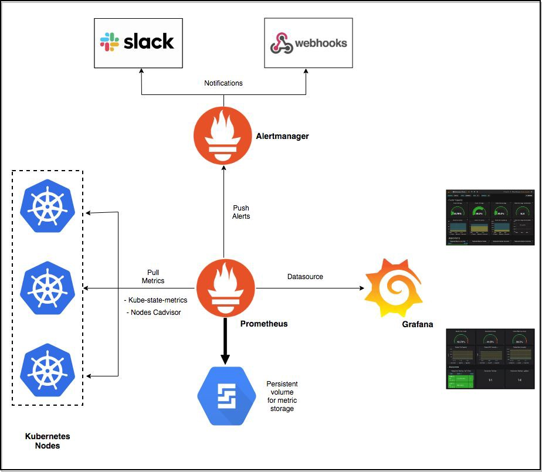
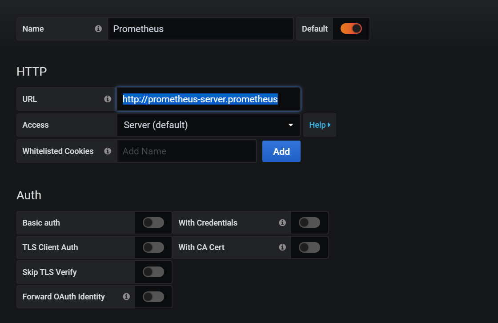

# monitoring-k8s
# start with at least 6 small GCP VM.Since ASG scale-in causes insufficent resource,disable ASG when creating cluster for LAB 
# purposes ONLY. 
Monitoring Solution for AKS using Prometheus and Grafana




A repository used for deploying Prometheus and Grafana on Azure AKS cluster.

# Usage

- [monitoring-k8s](#monitoring-k8s)
- [Usage](#usage)
  - [Deploy Azure Storage Class](#deploy-azure-storage-class)
  - [Deploy NGINX Ingress Controller](#deploy-nginx-ingress-controller)
  - [Deploy cert-manager](#deploy-cert-manager)
  - [Deploy Prometheus](#deploy-prometheus)
  - [Deploy Grafana](#deploy-grafana)
- [Acknowledgments](#acknowledgments)

## Deploy Azure Storage Class

To define different tiers of storage, such as Premium and Standard, you can
create a StorageClass. The StorageClass also defines the reclaimPolicy. This
reclaimPolicy controls the behavior of the underlying Azure storage resource
when the pod is deleted and the persistent volume may no longer be required.
The underlying storage resource can be deleted, or retained for use with a
future pod.

In AKS, two initial StorageClasses are created:

* **default** - Uses Azure Standard storage to create a Managed Disk. The
  reclaim policy indicates that the underlying Azure Disk is deleted when the
  persistent volume that used it is deleted.
* **managed-premium** - Uses Azure Premium storage to create Managed Disk. The
  reclaim policy again indicates that the underlying Azure Disk is deleted when
  the persistent volume that used it is deleted.


If no StorageClass is specified for a persistent volume, the default
StorageClass is used. Take care when requesting persistent volumes so that they
use the appropriate storage you need. You can create a StorageClass for
additional needs using kubectl.

```
$ kubectl apply --filename='./storage-class.yml'
```

Verify that the storage class was provisioned with the correct attributes. We
are looking for the **ReclaimPolicy** attribute to be set to **Retain** and the
**AllowVolumeExpansion** attribute to be set to **True**.

```
$ kubectl describe storageclass managed-premium-retain

Name:            managed-premium-retain
IsDefaultClass:  No

Provisioner:           kubernetes.io/azure-disk
Parameters:            kind=Managed,storageaccounttype=Premium_LRS
AllowVolumeExpansion:  True
MountOptions:          <none>
ReclaimPolicy:         Retain
VolumeBindingMode:     Immediate
Events:                <none>
```

## Deploy NGINX Ingress Controller

In order to be able to expose services inside your cluster to the outside
world, you will need an Ingress Controller. You can use a Helm chart to
customize and automate the deployment of an Ingress Controller.

Make sure you have the stable repo added to your Helm client.

```
$ helm repo add stable https://charts.helm.sh/stable
$ helm repo update
```

Create a namespace to house the resources created by the nginx-ingress Helm
chart. In this tutorial I will be using ingress controller per namespace and
hence I will deploy it to the grafana namespace. The ingress controller will be
using a defined scope to watch for ingress on the grafana namespace only.

```
$ kubectl create namespace grafana
```

Deploy the nginx-ingress Helm chart. You can specify the version that you
desire to deploy. By specifying a version, you are able to track what version
of the chart you deployed. It is recommended to include a version when
deploying a Helm chart.

Linux:

```
$ helm install ingress-grafana stable/nginx-ingress \
    --namespace grafana \
    --values ./nginx-ingress/values.yml \
    --version 1.34.3
```

Windows (PowerShell):

```
PS> helm install ingress-grafana stable/nginx-ingress `
      --namespace grafana `
      --values .\nginx-ingress\values.yml `
      --version 1.34.3
```

Verify that the Ingress controller was deployed successfully. Note that the
service name includes the name of the chart deployed followed by
**-nginx-ingress-controller**. Replace the service name with the name of the
chart you used to deploy the Ingress controller.

Linux:

```
$ kubectl get service ingress-grafana-nginx-ingress-controller \
    --namespace grafana \
    --output=jsonpath="{.status.loadBalancer.ingress[0].ip}"
```

Windows (PowerShell):

```
PS> kubectl get service ingress-grafana-nginx-ingress-controller `
      --namespace grafana `
      --output=jsonpath="{.status.loadBalancer.ingress[0].ip}"
```

The command should of returned an IP address that was used to expose the
Ingress controller. Verify that you can hit the **default backend** of the
Ingress controller.

Linux:

```
$ curl --verbose ${IP_ADDRESS}/healthz
```

Windows (PowerShell):

```
PS> Invoke-WebRequest -Uri ${IP_ADDRESS}/healthz
```

You should have received a **HTTP 200** OK response code. On Linux, make sure
to use the verbose flag with curl (--verbose).

## Deploy cert-manager

cert-manager is a Kubernetes addon to automate the management and issuance of
TLS certificates from various issuing sources. It will ensure certificates are
valid and up to date periodically, and attempt to renew certificates at an
appropriate time before expiry.

Create a namespace to house the resources created by the cert-manager Helm
chart.

```
$ kubectl create namespace cert-manager
```

Install the CustomResourceDefinition resources separately.

Linux:

```
$ kubectl apply \
    --validate=false \
    --filename=https://github.com/jetstack/cert-manager/releases/download/v0.14.0/cert-manager.crds.yaml
```

Windows (PowerShell):

```
PS> kubectl apply `
      --validate=false `
      --filename=https://github.com/jetstack/cert-manager/releases/download/v0.14.0/cert-manager.crds.yaml
```

Add the jetstack Helm repository.

```
$ helm repo add jetstack https://charts.jetstack.io
$ helm repo update
```

Deploy the cert-manager Helm chart and issue your first certificate. You have
the choice of issuing a certificate managed by Let's Encrypt or a selfsigned
certificate. If you choose to issue a selfsigned certificate, make sure to
distribute the Certificate Authority (CA).

Make sure to update the values in **./cert-manager/grafana-selfsigning.yml**
to reflect the domain name that you are using. Change the  **commonName** and
**dnsNames** to reflect your domain name.

Linux:

```
$ helm install cert-manager jetstack/cert-manager \
    --namespace cert-manager \
    --values ./cert-manager/values.yml \
    --version v0.14.0

# ========================  WAIT 1-2 MIN to let helm create certificate, then apply below  ===========================

$ kubectl apply --filename='./cert-manager/grafana-selfsigning.yml'
```

Windows (PowerShell):

```
PS> helm install cert-manager jetstack/cert-manager `
      --namespace cert-manager `
      --values .\cert-manager\values.yml `
      --version v0.14.0

PS> kubectl apply --filename='.\cert-manager\grafana-selfsigning.yml'
```

Verify that the issuer and certificate was generated in the grafana
namespace. Make sure you wait for the certificate to be generated.

```
$ kubectl get issuer --namespace grafana

NAME                 READY   AGE
selfsigning-issuer   True    48s

$ kubectl get certificate --namespace grafana

NAME          READY   SECRET      AGE
grafana-tls   True    grafana-tls   62s
```

Fetch the selfsigned CA certificate and import it to the Trusted Root
Certification Authorities store. Refer to 
[How to manage Trusted Root Certificates in Windows 10](https://www.thewindowsclub.com/manage-trusted-root-certificates-windows)
to import the CA certificate in Windows 10.

Linux:

```
$ kubectl get secret grafana-tls \
    --namespace grafana \
    --output=jsonpath="{.data.ca\.crt}" \
    | base64 --decode
```

Windows (PowerShell):

```
PS> $certificate = kubectl get secret grafana-tls `
      --namespace grafana `
      --output=jsonpath="{.data.ca\.crt}"

PS> [System.Text.Encoding]::UTF8.GetString([System.Convert]::FromBase64String($certificate))
```

## Deploy Prometheus


Make sure you have the stable repo added to your Helm client.

```
$ helm repo add stable https://charts.helm.sh/stable
$ helm repo update
```

```
$ kubectl create namespace prometheus
```

Deploy the prometheus Helm chart.

Linux:

```
$ helm install prometheus stable/prometheus \
    --namespace prometheus \
    --values ./prometheus/values-prometheus.yml \
    --version 11.1.1
```

Windows (PowerShell):

```
PS> helm install prometheus stable/prometheus `
      --namespace prometheus `
      --values .\prometheus\values-prometheus.yml `
      --version 11.1.1
```

Verify that the deployment was successful. You need to check that the all the  pods are running.

```
$ kubectl get all --namespace prometheus
$ kubectl get pods --namespace prometheus

NAME                                            READY   STATUS    RESTARTS   AGE
prometheus-alertmanager-7d87564cb-bqdbf         2/2     Running   2          21h
prometheus-kube-state-metrics-6756bbbb8-4rkqm   1/1     Running   2          21h
prometheus-node-exporter-fddlj                  1/1     Running   1          21h
prometheus-node-exporter-v7mcv                  1/1     Running   1          21h
prometheus-pushgateway-56ff66bc79-zm74r         1/1     Running   1          21h
prometheus-server-7998f5bc9-q4gcf               2/2     Running   2          21h
```
## Deploy Grafana


Make sure you have the stable repo added to your Helm client.

```
$ helm repo add stable https://charts.helm.sh/stable
$ helm repo update
```

Deploy the grafana Helm chart.

Linux:

```
$ helm install grafana stable/grafana \
    --namespace grafana \
    --values ./grafana/values-grafana.yml \
    --version 5.0.13
```

Windows (PowerShell):

```
PS> helm install grafana stable/grafana `
      --namespace grafana `
      --values .\grafana\values-grafana.yml `
      --version 5.0.13
```

Verify that the deployment was successful. You need to check that the all the  pods are running.

```
$ kubectl get all --namespace grafana
$ kubectl get pods --namespace grafana

NAME                                                                READY   STATUS    RESTARTS   AGE
pod/grafana-9dc94b4-5rkxx                                           1/1     Running   1          25h
pod/ingress-grafana-nginx-ingress-controller-5dc4fcd8b4-h865x       1/1     Running   2          27h
pod/ingress-grafana-nginx-ingress-default-backend-79cd654d9-zjhc6   1/1     Running   1          27h

NAME                                                    TYPE           CLUSTER-IP     EXTERNAL-IP     PORT(S)                      AGE
service/grafana                                         ClusterIP      10.0.226.217   <none>          80/TCP                       25h
service/ingress-grafana-nginx-ingress-controller        LoadBalancer   10.0.153.167   20.184.241.73   80:31696/TCP,443:32227/TCP   27h
service/ingress-grafana-nginx-ingress-default-backend   ClusterIP      10.0.246.129   <none>          80/TCP                       27h

```

Make sure you update the **host** value in **./grafana/values.yml**
to reflect the hostname that you are using for your grafana instance.

You need to get the password to login in grafana dashboard.

```
kubectl get secret --namespace grafana grafana -o jsonpath="{.data.admin-password}" | base64 --decode ; echo
```
After you logged into grafana use the data source 

Put the url to servicename.namespace

http://prometheus-server.prometheus




# Acknowledgments

[cert-manager Documentation](https://cert-manager.io/docs/)

[NGINX Ingress Controller Documentation](https://kubernetes.github.io/ingress-nginx/)

[Prometheus Documentation](https://prometheus.io/docs/introduction/overview/)

[Grafana Documentation](https://grafana.com/docs/grafana/latest/)
